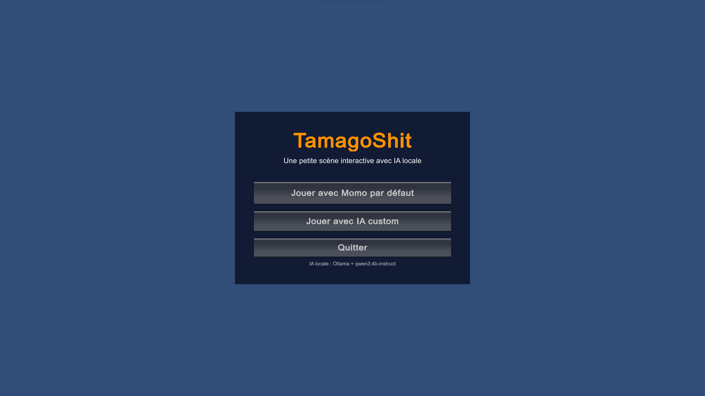

# TamagoShit — Scène 3D interactive avec IA locale

Projet Unity mélangeant une scène 3D low-poly, un personnage interactif nommé **Momo**, une IA locale via **Ollama**, des déplacements via **NavMesh**, des points d'intérêt dans la scène, une personnalité personnalisable et une interaction spéciale avec le dragon.

L'objectif du projet est de créer une petite expérience interactive vivante : le joueur peut parler à Momo, lui demander de regarder ou rejoindre des objets visibles dans la scène, personnaliser sa personnalité, et déclencher certaines interactions de scène via langage naturel.

---

## Sommaire

- [Aperçu](#aperçu)
- [Fonctionnalités](#fonctionnalités)
- [Prérequis](#prérequis)
- [Installation](#installation)
- [Configuration Unity](#configuration-unity)
- [Lancer le projet](#lancer-le-projet)
- [Guide d'utilisation](#guide-dutilisation)
- [Personnalité IA custom](#personnalité-ia-custom)
- [Système d'interactions](#système-dinteractions)
- [Points d'intérêt de scène](#points-dintérêt-de-scène)
- [Déplacement de Momo avec NavMesh](#déplacement-de-momo-avec-navmesh)
- [Interaction dragon](#interaction-dragon)
- [Structure des scripts](#structure-des-scripts)
- [Dépannage](#dépannage)
- [Limites actuelles](#limites-actuelles)
- [Pistes d'amélioration](#pistes-damélioration)
- [Crédits](#crédits)

---

## Aperçu

Ce projet contient une scène dans laquelle le joueur peut discuter avec un petit personnage, Momo.  
Momo est contrôlé par une IA locale exécutée avec Ollama. Il peut répondre au joueur, se souvenir des messages récents, se déplacer vers des points d'intérêt réels placés dans la scène, regarder des objets, et déclencher l'animation d'attaque du dragon.

### Capture — Menu principal

> **Placeholder image à remplacer**  
> Chemin conseillé : `Docs/Images/main-menu.png`  
> Dimensions recommandées : **1920 × 1080 px**  
> Contenu attendu : menu principal avec les boutons `Jouer avec Momo par défaut`, `Jouer avec IA custom`, `Quitter`.

```md

```

### Capture — Chat avec Momo

> **Placeholder image à remplacer**  
> Chemin conseillé : `Docs/Images/momo-chat.png`  
> Dimensions recommandées : **1920 × 1080 px**  
> Contenu attendu : SampleScene avec la chatbox visible, Momo dans la scène, une question utilisateur et une réponse IA.

```md

```

### Capture — Déplacement vers un point d'intérêt

> **Placeholder image à remplacer**  
> Chemin conseillé : `Docs/Images/momo-navmesh-interaction.png`  
> Dimensions recommandées : **1920 × 1080 px**  
> Contenu attendu : Momo en train de se déplacer vers le dock, le puits, le palmier ou un autre point d'intérêt.

```md

```

---

## Fonctionnalités

### IA locale

- Modèle local exécuté via **Ollama**
- Modèle testé : `qwen3:4b-instruct` (léger en local, mais assez fiable pour suivre des instructions et produire du JSON)
- Appel HTTP local vers l'API Ollama
- Réponses structurées en JSON
- Parsing côté Unity
- Gestion de fallback si l'IA répond mal ou si Ollama ne répond pas

### Dialogue avec mémoire courte

Momo garde un historique récent de la conversation.  
Cela lui permet de tenir compte des messages précédents et d'éviter de répondre comme si chaque message était isolé.

Exemple :

```txt
Joueur : Où est le puits ?
Momo : Le puits est au centre de la place.
Joueur : Regarde-le.
Momo : Je regarde le puits.
```

### Personnalité par défaut

La personnalité par défaut est celle de **Momo**, une petite taupe-guide douce, curieuse et un peu maladroite.  
Elle est utilisée quand le joueur choisit le mode par défaut dans le menu principal.

### IA custom

Le joueur peut créer une personnalité personnalisée avant de lancer la scène :

- nom du personnage ;
- rôle ;
- ton ;
- règles de comportement ;
- backstory.

La personnalité est sauvegardée localement, puis rechargée au lancement de `SampleScene`.

### Interactions de scène

Momo peut actuellement :

- répondre au joueur ;
- regarder un objet ;
- décrire un objet ;
- se déplacer vers un point d'intérêt ;
- déclencher l'animation d'attaque du dragon.

### Déplacement intelligent

Les déplacements de Momo utilisent un **NavMeshAgent**.  
Il ne traverse donc pas les bâtiments ou les obstacles.

### Points d'intérêt réels

Les objets interactifs sont limités et prédéfinis via des GameObjects marqueurs placés directement dans la scène Unity.

---

## Prérequis

### Logiciels

- Unity, version recommandée : **Unity 6** ou version utilisée par le projet (6000.3.6).
- Ollama installé sur la machine.
- Git, si le projet est récupéré depuis un dépôt.

### Modèle IA

Le projet est prévu pour fonctionner avec :

```bash
qwen3:4b-instruct
```

Vérifiez les modèles installés :

```bash
ollama list
```

Si le modèle n'est pas installé :

```bash
ollama pull qwen3:4b-instruct
```

### Vérifier qu'Ollama répond

Sous PowerShell :

```powershell
$body = @{
    model = "qwen3:4b-instruct"
    prompt = "Réponds uniquement: OK"
    stream = $false
} | ConvertTo-Json

Invoke-RestMethod -Uri "http://localhost:11434/api/generate" -Method Post -ContentType "application/json" -Body $body
```

Résultat attendu : une réponse contenant `OK`.

---

## Installation

### 1. Cloner le projet

```bash
git clone <url-du-repo>
cd <nom-du-projet>
```

### 2. Ouvrir avec Unity

Ouvrez le dossier du projet dans Unity Hub.

### 3. Restaurer les packages

Unity devrait restaurer automatiquement les packages nécessaires.  
Si le package de navigation manque, installez-le :

```txt
Window > Package Manager > Unity Registry > AI Navigation
```

### 4. Installer Ollama

Téléchargez et installez Ollama depuis le site officiel.

Ensuite :

```bash
ollama pull qwen3:4b-instruct
```

### 5. Lancer Ollama

Ollama est souvent lancé automatiquement en arrière-plan.  
Sinon :

```bash
ollama serve
```

---

## Configuration Unity

### Scènes

Les scènes importantes sont :

```txt
Assets/Scenes/MainMenuScene.unity
Assets/Scenes/AiPersonalityMenuScene.unity
Assets/Scenes/SampleScene.unity
```

Dans les **Build Settings**, l'ordre conseillé est :

```txt
0 - MainMenuScene
1 - AiPersonalityMenuScene
2 - SampleScene
```

Menu Unity :

```txt
File > Build Settings
```

Ajoutez les scènes ouvertes avec `Add Open Scenes`.

---

## Lancer le projet

### Depuis Unity

1. Ouvrir `MainMenuScene`.
2. Vérifier qu'Ollama est lancé.
3. Appuyer sur `Play`.
4. Choisir :
   - `Jouer avec Momo par défaut`, ou
   - `Jouer avec IA custom`.

### Depuis SampleScene directement

Il est aussi possible de lancer directement `SampleScene`, mais le comportement recommandé est de passer par `MainMenuScene`, surtout pour tester le mode custom.

---

## Guide d'utilisation

### Menu principal

Le menu principal propose :

- **Jouer avec Momo par défaut**  
  Lance la scène avec la personnalité standard de Momo.

- **Jouer avec IA custom**  
  Ouvre le menu de création de personnalité.

- **Quitter**  
  Quitte l'application. Dans l'éditeur Unity, le bouton arrête le Play Mode.

### Chatbox

Dans `SampleScene`, une chatbox apparaît en bas de l'écran.

Pour envoyer un message :

1. Cliquer dans le champ texte.
2. Écrire un message.
3. Appuyer sur `Entrée`.

Exemples :

```txt
Salut, qui es-tu ?
```

```txt
Va au dock.
```

```txt
Regarde le puits.
```

```txt
Va voir le palmier.
```

```txt
Active le dragon.
```

Au chargement de la scène, un premier prompt automatique est envoyé :

```txt
Salut, qui es-tu ?
```

Cela permet à Momo de se présenter immédiatement.

### Capture — Présentation automatique de Momo

> **Placeholder image à remplacer**  
> Chemin conseillé : `Docs/Images/startup-prompt.png`  
> Dimensions recommandées : **1920 × 1080 px**  
> Contenu attendu : premier message automatique et réponse de présentation de Momo.

```md

```

---

## Personnalité IA custom

Le mode IA custom permet de définir une personnalité personnalisée.

Champs disponibles :

- **Nom du personnage**
- **Rôle**
- **Ton**
- **Règles de comportement**
- **Backstory / personnalité**

### Capture — Menu IA custom

> **Placeholder image à remplacer**  
> Chemin conseillé : `Docs/Images/custom-ai-menu.png`  
> Dimensions recommandées : **1920 × 1080 px**  
> Contenu attendu : écran de personnalisation avec les champs remplis.

```md

```

---

## Système d'interactions

L'IA ne renvoie pas seulement du texte.  
Elle doit répondre avec un JSON structuré contenant :

```json
{
  "dialogue": "phrase courte affichée au joueur",
  "intent": "talk | explain_object | look_at_object | move_to_object | activate_dragon | fallback",
  "action": {
    "type": "none | look_at | describe | move_to | activate_dragon",
    "target": "id exact du catalogue ou none"
  }
}
```

Exemple pour regarder un objet :

```json
{
  "dialogue": "Je regarde le puits au centre de la place.",
  "intent": "look_at_object",
  "action": {
    "type": "look_at",
    "target": "well"
  }
}
```

Exemple pour se déplacer :

```json
{
  "dialogue": "J'y vais, je vais regarder le dock de plus près.",
  "intent": "move_to_object",
  "action": {
    "type": "move_to",
    "target": "dock"
  }
}
```

Exemple pour déclencher le dragon :

```json
{
  "dialogue": "D'accord... je réveille le dragon.",
  "intent": "activate_dragon",
  "action": {
    "type": "activate_dragon",
    "target": "dragon"
  }
}
```

---

## Points d'intérêt de scène

Les objets interactifs sont définis avec des marqueurs Unity.

### Script utilisé

```txt
SceneInterestPointMarker
```

Chaque marqueur contient :

- `id` : identifiant utilisé par l'IA ;
- `displayName` : nom affichable ;
- `aliases` : mots que le joueur peut utiliser ;
- `description` : description donnée au modèle ;
- `allowedInteractions` : interactions autorisées ;
- position du GameObject : vraie position utilisée pour le déplacement/regard.

### Exemple : dock

```txt
id: dock
displayName: le ponton
aliases: ponton, dock, entrée, passerelle, bord de mer
description: Le ponton en bois à l'entrée de l'île, face à la mer.
allowedInteractions: look_at, describe, move_to
```

### Exemple : puits

```txt
id: well
displayName: le puits
aliases: puits, vieux puits, centre, place centrale
description: Le puits gris situé au centre de la place.
allowedInteractions: look_at, describe, move_to
```

### Recommandations de placement

Placez les marqueurs :

- près de l'objet réel ;
- sur une zone accessible du NavMesh ;
- pas dans un mur ;
- pas au centre d'un bâtiment ;
- pas trop loin de l'objet décrit.

Pour un bâtiment, placez le marqueur devant la porte ou sur le chemin.  
Pour un objet décoratif, placez le marqueur juste à côté, côté accessible.

### Capture — Markers Unity

> **Placeholder image à remplacer**  
> Chemin conseillé : `Docs/Images/interest-point-markers.png`  
> Dimensions recommandées : **1920 × 1080 px**  
> Contenu attendu : vue Scene Unity avec les marqueurs `AI_Point_Dock`, `AI_Point_Well`, etc.

```md

```

---

## Interaction dragon

Le projet contient une interaction spéciale :

```txt
activate_dragon
```

Quand l'IA renvoie cette action, le script appelle le trigger Animator du dragon :

```csharp
dragonAnimator.SetTrigger("Attack");
```

### Commandes utilisateur possibles

```txt
Active le dragon.
```

```txt
Fais attaquer le dragon.
```

```txt
Réveille le dragon.
```

### Configuration

Dans `SampleSceneAiController`, il faut que le champ `Dragon Animator` référence l'Animator du dragon.

Le script tente de le trouver automatiquement, mais si l'animation ne se déclenche pas :

1. Sélectionner `Scene AI Controller`.
2. Glisser l'objet dragon ou son `Animator` dans le champ `Dragon Animator`.
3. Vérifier que le controller d'animation contient un trigger nommé :

```txt
Attack
```

### Capture — Dragon attack

> **Placeholder image à remplacer**  
> Chemin conseillé : `Docs/Images/dragon-attack.png`  
> Dimensions recommandées : **1920 × 1080 px**  
> Contenu attendu : dragon pendant ou juste après l'animation d'attaque.

```md

```

---

## Structure des scripts

Structure principale :

```txt
Assets/
└── Script/
    ├── LocalAI/
    │   ├── Config/
    │   │   ├── AiPersonality.cs
    │   │   ├── AiPersonalityMode.cs
    │   │   ├── AiPersonalityStorage.cs
    │   │   ├── MoleDefaultPersonality.cs
    │   │   └── MolePersonalityInstaller.cs
    │   │
    │   ├── Models/
    │   │   ├── AiAction.cs
    │   │   ├── AiChatMessage.cs
    │   │   ├── AiInteractionContext.cs
    │   │   ├── AiResponse.cs
    │   │   └── SceneInterestPoint.cs
    │   │
    │   ├── Ollama/
    │   │   ├── OllamaClient.cs
    │   │   ├── OllamaRequest.cs
    │   │   └── OllamaResponse.cs
    │   │
    │   ├── Pipeline/
    │   │   ├── AiPipeline.cs
    │   │   ├── AiPromptBuilder.cs
    │   │   └── AiResponseParser.cs
    │   │
    │   ├── Runtime/
    │   │   └── OllamaRuntimeManager.cs
    │   │
    │   ├── Scene/
    │   │   ├── SampleSceneAiController.cs
    │   │   └── SceneInterestPointMarker.cs
    │   │
    │   └── UI/
    │       ├── AiPersonalityMenu.cs
    │       └── SimpleMainMenu.cs
    │
    ├── MopeController.cs
    └── LowPolyWind.cs
```

### Rôle des scripts principaux

| Script | Rôle |
|---|---|
| `SimpleMainMenu.cs` | Menu principal du projet |
| `AiPersonalityMenu.cs` | Menu de création de personnalité custom |
| `AiPersonalityStorage.cs` | Sauvegarde/chargement de la personnalité |
| `AiPromptBuilder.cs` | Construction du prompt envoyé au modèle |
| `AiPipeline.cs` | Pipeline globale IA : prompt → Ollama → parsing |
| `OllamaClient.cs` | Requête HTTP vers Ollama |
| `AiResponseParser.cs` | Extraction et parsing du JSON IA |
| `SampleSceneAiController.cs` | Contrôle de la chatbox et application des actions IA |
| `SceneInterestPointMarker.cs` | Définition des vrais points d'intérêt de scène |
| `MopeController.cs` | Contrôle NavMesh/animation de Momo |
| `LowPolyWind.cs` | Animation de vent low-poly sur certains objets |

---

## Prompt IA

Le prompt contient plusieurs blocs :

1. Identité du personnage.
2. Règles anti-hallucination.
3. Règles d'action.
4. Catalogue des objets autorisés.
5. Historique récent de conversation.
6. Message actuel du joueur.
7. Format JSON obligatoire.

Le modèle ne doit pas inventer des objets absents de la scène.  
Il doit choisir uniquement des cibles présentes dans le catalogue généré depuis les `SceneInterestPointMarker`.

---

## Dépannage

### Ollama ne répond pas

Vérifier que le serveur tourne :

```bash
ollama list
```

Tester l'API :

```powershell
$body = @{
    model = "qwen3:4b-instruct"
    prompt = "Réponds uniquement: OK"
    stream = $false
} | ConvertTo-Json

Invoke-RestMethod -Uri "http://localhost:11434/api/generate" -Method Post -ContentType "application/json" -Body $body
```

### Mauvais nom de modèle

Dans Unity, vérifier le champ :

```txt
modelName = qwen3:4b-instruct
```

Si le modèle a un autre nom, modifier ce champ dans `SampleSceneAiController`.

### L'IA parle d'un objet absent

Vérifier :

- que le prompt contient bien les règles anti-hallucination ;
- que les objets autorisés sont bien dans des `SceneInterestPointMarker` ;
- que les descriptions ne mentionnent pas d'objets inexistants ;
- que l'ancien fichier `ai_personality.json` ne contient pas une vieille backstory.

### Momo ne bouge pas

Vérifier :

- Momo a un `NavMeshAgent` ;
- Momo est posé sur le NavMesh ;
- le NavMesh est bien bake ;
- la destination est proche du NavMesh ;
- le marqueur cible existe ;
- le modèle renvoie bien `action.type = "move_to"`.

### Momo va au mauvais endroit

Vérifier la position du `SceneInterestPointMarker`.  
Le script utilise la position du marker, pas la position visuelle de l'objet.

### Le dragon n'attaque pas

Vérifier :

- le champ `Dragon Animator` ;
- le nom du trigger : `Attack` ;
- le controller d'animation du dragon ;
- le JSON renvoyé par l'IA.

### Le nom custom ne s'affiche pas

Vérifier que :

- vous êtes passés par `Jouer avec IA custom` ;
- vous avez cliqué sur `Utiliser cette personnalité et jouer` ;
- le champ `Nom du personnage` n'est pas vide ;
- `MolePersonalityInstaller` n'écrase pas la personnalité custom.

### Input Entrée ne marche pas

Cliquer dans le champ de texte avant d'appuyer sur `Entrée`.  
Le système actuel utilise une UI IMGUI simple.

---

## Limites actuelles

- L'IA dépend d'Ollama lancé localement.
- Les réponses du modèle peuvent parfois être mal formatées (solution -> fallback).
- Les points d'intérêt doivent être placés à la main.

---

## Pistes d'amélioration

### UI

- Remplacer l'IMGUI par une vraie interface Unity UI ou UI Toolkit.
- Ajouter un historique visible de conversation.
- Ajouter des bulles de dialogue au-dessus de Momo.
- Ajouter un bouton d'envoi en plus de `Entrée`.

### IA

- Ajouter un système de sauvegarde de profil longue durée.
- Ajouter un système de chargement de personnalité sauvegardée.
- Ajouter un bouton pour supprimer une personnalité.

### Interactions

- Ajouter des animations spécifiques :
  - regarder ;
  - s'asseoir ;
  - pointer ;
  - réagir au dragon ;
  - saluer le joueur.
- Ajouter de nouveaux objets interactifs.
- Ajouter des descriptions contextuelles selon la position de Momo.

### Navigation

- Ajouter des points d'arrêt différents pour regarder et pour se déplacer.
- Ajouter une rotation finale vers l'objet après déplacement.
- Ajouter des zones interdites plus précises.
- Ajouter des animations idle non intrusives, sans écraser les commandes utilisateur.

---

## Crédits

Projet réalisé dans le cadre d'un travail sur l'intégration d'IA générative locale dans une expérience 3D temps réel.

Technologies utilisées :

- Unity
- Ollama
- Qwen3 4B Instruct
- NavMesh / AI Navigation
- C#
- Modèles et assets low-poly de scène
